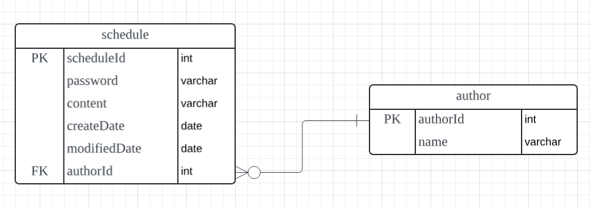

## 개인 과제 3: 일정 관리 앱 만들기

 

### 프로젝트 소개
- 일정 관리 앱은 사용자가 일정을 추가, 조회, 수정, 삭제하는 RESTFUL API를 구현하는 어플리케이션입니다.
- 작성 당시 비밀번호를 입력받고 해당 비밀번호와 일치할 경우에만 수정, 삭제가 가능합니다.
- JPA를 사용해보기 전 연습 프로젝트로 JDBC를 사용하여 SQL 쿼리 작성과 데이터 관리를 합니다.

 

### 프로젝트 조건
- 3 Layer Architectrue에 따라 각 Layer에 맞게 구현합니다.
- Entity를 그대로 반환하지 말고, DTO에 담아서 반환합니다.
- 반환 받은 정보에 비밀번호는 제외되어야 합니다.

 

### 필수 기능 구현
- #### Lv 1.
  - #### [API 명세서](https://buttery-caravel-ad6.notion.site/0c6128a26a16468e8eea13fe2ca79131?v=ea833add42784c129a0d3a8119058308)

 

  - #### ERD 작성
    

 

- #### Lv 2.
  - 일정 생성(일정 작성하기)
    - 할일, 작성자명, 비밀번호, 작성/수정일는 반드시 포함되어야 함.
    - 일정의 고유 식별자(ID)를 자동으로 생성하여 관리.
    - 수정일은 작성일과 동일
  - 전체 일정 조회(등록된 일정 불러오기)
    - `수정일`(형식 : YYYY-MM-DD)과 `작성자명`으로 일정 목록을 전부 조회
    - 조건 중 한 가지만 충족하거나, 둘 다 충족을 하지 않을 수도, 두 가지를 모두 충족할 수도 있음.
    - 수정일 기준 내림차순으로 정렬
  - 선택 일정 조회(선택한 일정 정보 불러오기) : 일정의 고유 식별자(ID)를 사용하여 조회
- #### Lv 3. 
  - 선택한 일정 수정 기능 추가 : 비밀번호를 함께 전달. 작성일은 변경 불가능 하며, 수정완료시 자동으로 수정한 시점으로 변경
  - 선택한 일정 삭제 기능 추가 : 비밀번호를 함께 

- #### Lv 4, Lv 5의 내용은 Lv3까지 구현 후 추가 예정.
