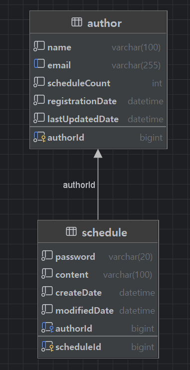

## 개인 과제 3: 일정 관리 앱 만들기

 

### 프로젝트 소개
- 일정 관리 앱은 사용자가 일정을 추가, 조회, 수정, 삭제하는 RESTFUL API를 구현하는 어플리케이션입니다.
- 작성 당시 비밀번호를 입력받고 해당 비밀번호와 일치할 경우에만 수정, 삭제가 가능합니다.
- JPA를 사용해보기 전 연습 프로젝트로 JDBC를 사용하여 SQL 쿼리 작성과 데이터 관리를 합니다.

 

### 프로젝트 조건
- 3 Layer Architectrue에 따라 각 Layer에 맞게 구현합니다.
- Entity를 그대로 반환하지 말고, DTO에 담아서 반환합니다.
- 반환 받은 정보에 비밀번호는 제외되어야 합니다.

 

### 필수 기능 구현
- #### Lv 1.
  - #### [API 명세서](https://buttery-caravel-ad6.notion.site/schedule-manager-08ebe8a59bdc4e4bac0ff9b714f524d4?pvs=4)

  - #### ERD 작성
      
    

 

- #### Lv 2.
  - 일정 생성(일정 작성하기)
    - 할일, 작성자명, 비밀번호, 작성/수정일는 반드시 포함되어야 함.
    - 일정의 고유 식별자(ID)를 자동으로 생성하여 관리.
    - 수정일은 작성일과 동일
  - 전체 일정 조회(등록된 일정 불러오기)
    - `수정일`(형식 : YYYY-MM-DD)과 `작성자명`으로 일정 목록을 전부 조회
    - 조건 중 한 가지만 충족하거나, 둘 다 충족을 하지 않을 수도, 두 가지를 모두 충족할 수도 있음.
    - 수정일 기준 내림차순으로 정렬
  - 선택 일정 조회(선택한 일정 정보 불러오기) : 일정의 고유 식별자(ID)를 사용하여 조회
- #### Lv 3. 
  - 선택한 일정 수정 기능 추가 : 비밀번호를 함께 전달. 작성일은 변경 불가능 하며, 수정완료시 자동으로 수정한 시점으로 변경
  - 선택한 일정 삭제 기능 추가 : 비밀번호를 함께 전달.

- #### Lv 4.
  - 연관 관계 설정하기
    - 작성자와 일정 연결 (일정 테이블에서 FK로 관리하고 동명이인이 있어도 구별할 수있게 구현)
    - 이름 외에 이메일, 등록일, 수정일 정보 갖도록 변경

- #### Lv 5.
  - 페이지네이션
    - 미구현..

### 트러블 슈팅
[트러블 슈팅 관련 링크](https://velog.io/@hwk__/%EC%9D%BC%EC%A0%95-%EA%B4%80%EB%A6%AC-%EC%95%B1-%ED%8A%B8%EB%9F%AC%EB%B8%94%EC%8A%88%ED%8C%85)

### 사용한 기술 스택
- Java, Spring Boot
- MySQL

### 주요 라이브러리
- Lombok: 보일러플레이트 코드를 줄이기 위한 라이브러리. 자동으로 getter, setter, 생성자 등을 생성.
- JDBCTemplate: 데이터베이스와의 상호작용을 위한 라이브러리. SQL 쿼리를 쉽게 실행하고 결과를 매핑하는 데 도움을 줌.

### API 특징
- HTML 템플릿 없이 JSON 형식으로만 응답을 제공하는 RESTful API입니다.

### 구조
- Controller
  - `ScheduleController` : 클라이언트 요청과 응답을 처리를 담당. DTO 객체로 Service계층으로 전달하고, 전달받은 DTO 객체를 클라이언트에게 응답.
  
- Service
  - `ScheduleService` : 일정 관리의 핵심 비즈니스 로직을 담당. 전달받은 DTO를 Entity로 변환하여 적절한 상태코드와 메시지를 전달.
    - 일정 생성, 수정, 삭제, 조회를 수행하며, 각각 알맞는 ResponseDto를 선택하여 컨트롤러에 반환
    
- Repository
  - `ScheduleRepository` : JDBCTemplate을 사용하여 DB와 직접적인 상호작용을 담당. SQL 쿼리를 실행하고 결과를 매핑하여 CRUD를 수행.
  
- Entity
  - `Author` : 작성자 엔티티. 작성자고유ID, 이름, 이메일, 작성 일정 개수, 계정생성일, 계정수정일의 정보를 담음. 작성 일정 개수는 작성자가 작성한 일정을 추적하는데 사용.
  - `Schedule` : 일정 엔티티. 일정고유ID, 작성자고유ID, 일정 내용, 일정 비밀번호, 생성일, 수정일 정보를 담음. 비밀번호는 수정 및 삭제 접근을 제어하는데 사용.

